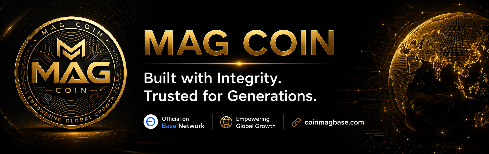

<div align="center">



<br />

# MAG COIN

### Built with Integrity. Trusted for Generations.

A long-term blockchain project built on Base Mainnet with transparency, responsible stewardship, continuous improvement, and sustainable growth at its foundation.

[Official Website](https://coinmagbase.com) •
[BaseScan](https://basescan.org/token/0xbBd90410031Ed51023EF26Cca4e3e4f638F51A94) •
[Uniswap](https://app.uniswap.org/explore/pools/base/0xfb1bb0105d24b563d83376e2d7425dd5e9652ca0) •
[Transparency Centre](https://coinmagbase.com/transparency)

</div>

---

## Official Project Information

| Item | Details |
|---|---|
| Project Name | MAG COIN |
| Token Symbol | MAG |
| Network | Base Mainnet |
| Token Standard | ERC-20 |
| Total Supply | 1,000,000,000 MAG |
| Decimals | 18 |
| Contract Address | `0xbBd90410031Ed51023EF26Cca4e3e4f638F51A94` |
| Contract Status | Verified on BaseScan |
| Official Website | https://coinmagbase.com |

> Always verify the contract address through the official MAG COIN website or BaseScan before interacting with the token.

---

## Project Purpose

MAG COIN is being developed as a transparent and responsibly managed digital asset project on Base.

The project is guided by the following principles:

- Integrity before popularity
- Safety before speed
- Transparency in development
- Responsible long-term stewardship
- Continuous documentation
- Organic community growth
- No fake hype or artificial volume

Our objective is to build genuine infrastructure, maintain clear public records, and develop the ecosystem gradually through verified milestones.

---

## Official Market

MAG COIN has an active MAG/USDC liquidity market on Base.

- **Network:** Base
- **Decentralized Exchange:** Uniswap
- **Official Pool:**  
  https://app.uniswap.org/explore/pools/base/0xfb1bb0105d24b563d83376e2d7425dd5e9652ca0

Trading digital assets involves significant risk. Users must independently verify all information and conduct their own research before making any decision.

---

## Official Documentation

| Resource | Official Link |
|---|---|
| Whitepaper | https://coinmagbase.com/whitepaper |
| Constitution | https://coinmagbase.com/constitution |
| Tokenomics | https://coinmagbase.com/tokenomics |
| Roadmap | https://coinmagbase.com/roadmap |
| Transparency Centre | https://coinmagbase.com/transparency |
| Ecosystem | https://coinmagbase.com/ecosystem |
| Audit Report | https://coinmagbase.com/audit |
| Security Centre | https://coinmagbase.com/security |
| Frequently Asked Questions | https://coinmagbase.com/faq |
| Contact | https://coinmagbase.com/contact |

---

## Official Communication Channels

Only use the official channels listed below.

| Platform | Official Channel |
|---|---|
| Website | https://coinmagbase.com |
| X | https://x.com/MAGCOINBASE |
| Telegram | https://t.me/MAGCOINBASE |
| Instagram | https://instagram.com/coinbasemag |
| Project Email | info@coinmagbase.com |

Official social links will also be maintained on the MAG COIN website.

---

## Website Technology

The official MAG COIN website is developed using:

- Next.js
- React
- TypeScript
- Vercel
- Base blockchain public data
- Responsive web design

This repository contains the source code for the official public website.

---

## Repository Structure

```text
mag-coin-website/
├── app/                 Website pages and application components
├── public/              Public logos, icons and media assets
├── .github/             Repository automation and configuration
├── README.md            Official repository overview
├── package.json         Project dependencies and scripts
└── next.config.*        Next.js configuration
